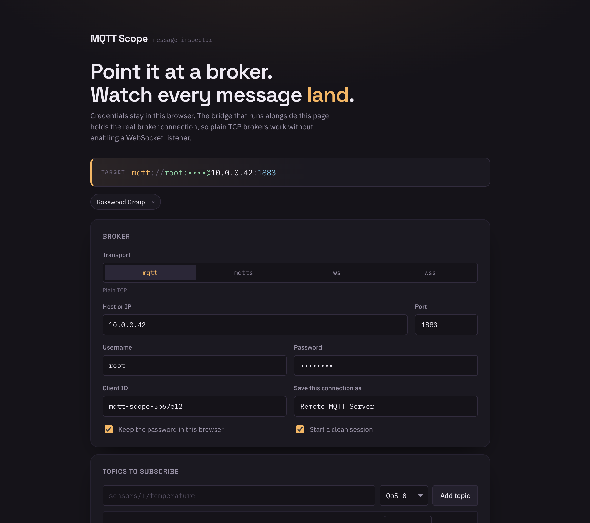
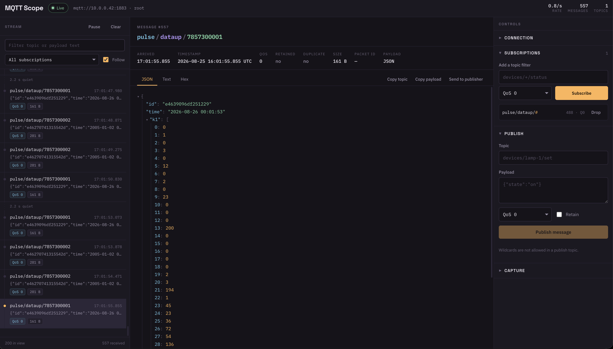

# MQTT Scope

A message inspector for MQTT networks. Subscribe to a set of topics, watch messages
arrive in real time, and open any one of them to read the payload and the packet flags
the broker delivered.



```bash
npm install
npm start
```

Then open <http://localhost:8787>.

`npm start` builds the interface and the bridge, then serves both. For UI work,
`npm run dev` runs the bridge (via `tsx`, watching for changes) and Vite together with hot
reload on <http://localhost:5180>. `npm run typecheck` builds every TypeScript project.

The whole thing is TypeScript in strict mode. The browser and the bridge share one set of
frame types in `shared/protocol.ts`, so a change to the wire format breaks the build on
both sides rather than at runtime.

## Why there is a small server

A browser cannot open a raw TCP socket, so a page can only reach brokers that expose an
MQTT-over-WebSocket listener. The bridge in `server/index.js` removes that limit: the page
sends JSON frames over a WebSocket, and the bridge holds the real MQTT connection using
whichever transport your broker speaks — `mqtt`, `mqtts`, `ws`, or `wss`. A stock
Mosquitto on port 1883 works with no configuration change.

Credentials are typed in the browser and kept in its local storage. They travel to the
bridge on connect and live only in that process's memory — nothing is written to disk
server-side, and nothing leaves your machine except the connection to your broker.

If you deploy this anywhere other than your own machine, put it behind authentication and
TLS: anyone who can reach the bridge can connect to any broker they can route to.

## Running it with Docker

```bash
docker build -t mqtt-scope .
docker run --init -p 127.0.0.1:8787:8787 mqtt-scope
```

The image builds the interface and compiles the bridge, then serves both from port 8787 as
an unprivileged user. `HOST` and `PORT` are the only settings; inside the container `HOST`
defaults to `0.0.0.0` so the port mapping works.

Publishing the port to `127.0.0.1` as shown keeps it on your machine. Bind it to a public
interface only behind TLS and something that authenticates callers — the bridge connects to
whatever broker the page names, so an open bridge is a way into every broker it can reach.

## Using it

**Setup screen.** Pick the transport, enter host, port, and optional credentials, then list
the topics to subscribe to. `+` matches one level, `#` matches the rest of the tree. The
composed broker URL at the top updates as you type, which is the quickest way to spot a
wrong port. Connections you use are saved as chips you can click to reload later; clear the
"Keep the password in this browser" box to leave the password out of local storage.

**Dashboard.**



- _Left — stream._ Every message as it lands, newest at the bottom, with a time rail that
  marks stretches of silence. Filter by topic or payload text, limit the view to one
  subscription, pause to hold the list still (held messages replay when you resume).
- _Centre — inspector._ Topic broken into levels, arrival time, QoS, retain and duplicate
  flags, payload size and packet ID. JSON payloads get a collapsible tree; everything else
  gets text and a hex dump. MQTT 5 user properties appear under Properties when present.
- _Right — controls._ Edit credentials, reconnect or disconnect, add and drop subscriptions
  without reconnecting, publish a message, set how many messages to keep, and export the
  buffer as JSON.

## Contributing

`CONTRIBUTING.md` covers the development setup, how to run a throwaway broker to test against,
and what CI checks. Licensed under MIT — see `LICENSE`.

## Layout

```
shared/protocol.ts     frame types shared by the page and the bridge
server/index.ts        WebSocket-to-MQTT bridge
src/App.tsx            screen state, filtering, export
src/types.ts           profiles, settings, messages, subscriptions
src/lib/useBridge.ts   bridge protocol, ring buffer, subscription bookkeeping
src/lib/storage.ts     saved connections in local storage
src/lib/format.ts      payload decoding, hex dump, time and size formatting
src/components/        Setup, MessageList, Inspector, JsonTree, Tools
```

Three TypeScript projects sit under the root `tsconfig.json`: `tsconfig.app.json` for the
browser code, `tsconfig.server.json` for the bridge (which emits to `build/`), and
`tsconfig.node.json` for the Vite config.
